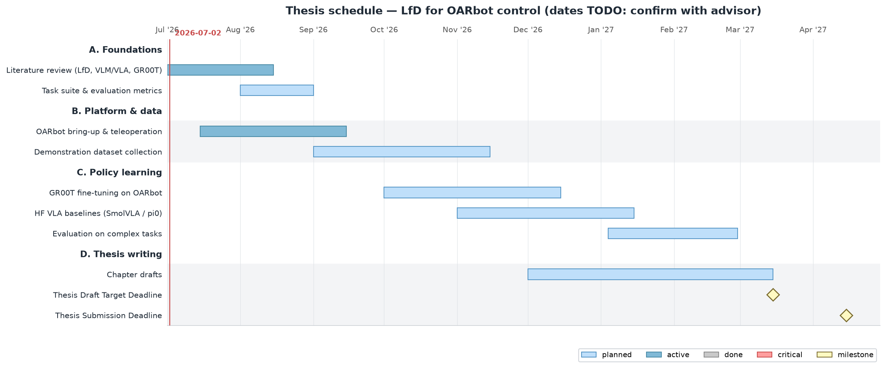

::: {.content-visible when-format="html"}
```{=html}
<style>
  .columns { gap: 1.5rem; }
  .column { padding: 0 0.25rem; }
  .column iframe { max-width: 100%; }
</style>
```
:::

## Where I am

> TODO

## Schedule snapshot {.smaller}

<!-- The PNG below is auto-generated by `scripts/render/build_gantt.py`
     when this WU's `date:` field is today or later. Once the date is
     past, the snapshot freezes (the file on disk is the fixed-in-time
     view the advisor saw in this week's update). Run `python
     scripts/render/build_gantt.py --force` to override. -->



## Progress this week

> TODO

## Video clip example

<!-- Local file in this WU's media/, or a relative path to an
     experiment's media/ folder. Reach into the initiatives tree
     when the WU is summarizing experiment work: -->

<!--  -->
<!--  -->

<!-- External embed: -->
<!--  -->

## Blockers

> TODO

## Next week

> TODO

## Questions for advisor

> TODO

::: {.content-visible unless-format="revealjs"}

:::
